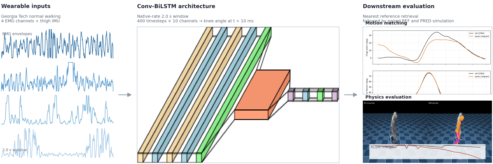
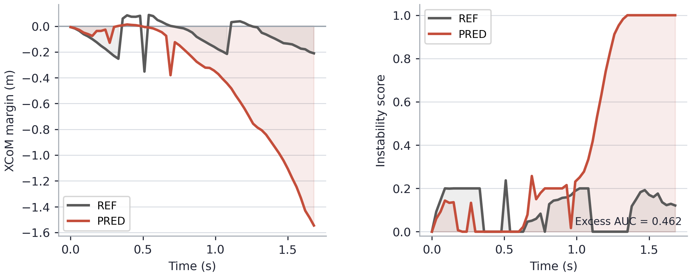
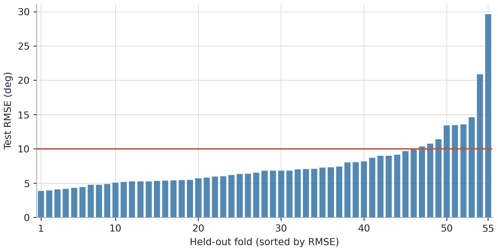
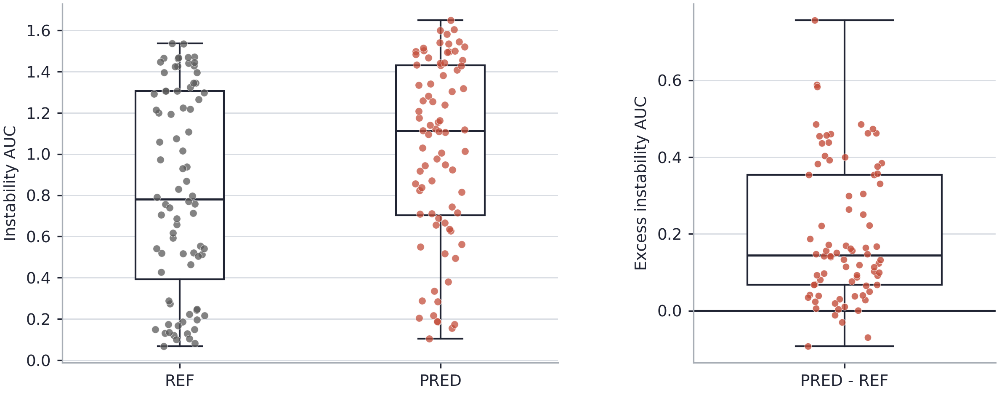
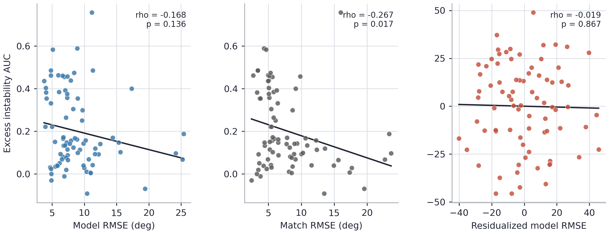
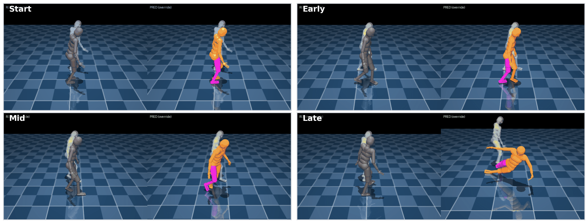
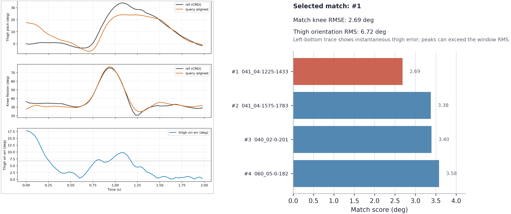

# emg_tst

Real-time knee-angle prediction from thigh EMG and IMU, evaluated inside MoCapAct physics simulation.

**Current pipeline:** Georgia Tech biomechanics dataset -> CNN-BiLSTM regressor -> motion matching -> MuJoCo REF/PRED rollouts -> partial Spearman analysis.

Instability note: the simulation produces an XCoM-margin-only per-step instability trace, not a calibrated fall probability. The paper outcome is excess instability AUC = `PRED - REF`, not absolute `PRED` AUC alone.

---

## Publication Checklist

Steps to reproduce the current paper numbers, in order:

**1. Regenerate GT recordings** (if the converter changed):
```bash
python -c "from emg_tst.gt_dataset import ensure_normal_walk_recordings; ensure_normal_walk_recordings()"
```

**2. Train the model:**
```bash
python -m emg_tst.run_experiment
```

**3. Rebuild the held-out query pool:**
```bash
python split_to_samples.py
```

**4. Run the physical simulation benchmark:**
```powershell
$env:EMG_TST_RUN_DIR = "checkpoints\\tst_20260405_173725_all"
$env:MOCAP_PHYS_EVAL_ALLOW_PARTIAL = "1"
$env:MOCAP_PHYS_EVAL_N_TRIALS = "80"
python -m mocap_phys_eval.run
```

**5. Run the partial-correlation analysis:**
```bash
python -m analysis.correlation --run-dir artifacts/phys_eval_v2/runs/<run_id>
```

**6. Regenerate paper figures:**
```bash
python -m analysis.make_paper_figures
```

---

## Paper Figures















Figure captions: [figures/paper_native/captions.md](figures/paper_native/captions.md)

---

## Current Benchmark Results

Training run: [checkpoints/tst_20260405_173725_all/metrics_summary.json](checkpoints/tst_20260405_173725_all/metrics_summary.json)

| Metric | Value |
|--------|-------|
| Mean held-out test RMSE | 7.84 deg |
| Median held-out test RMSE | 6.85 deg |
| Mean held-out MAE | 6.11 deg |
| Folds below 10 deg | 83.6% |

Simulation run: [artifacts/phys_eval_v2/runs/20260406_205003/summary.json](artifacts/phys_eval_v2/runs/20260406_205003/summary.json)

| Metric | Value |
|--------|-------|
| Trials | 80 |
| Mean model pred RMSE (vs GT wearable) | 8.80 deg |
| Mean motion-match knee RMSE (CNN pred vs clip) | 7.93 deg |
| Mean REF instability AUC | 0.819 |
| Mean PRED instability AUC | 1.019 |
| Mean excess instability AUC | 0.200 |
| Excess instability AUC > 0 | 95% of trials |
| Raw Spearman rho (model RMSE vs excess AUC) | -0.168, p = 0.136 |
| Partial Spearman rho (after FWL controls) | -0.019, p = 0.867 |

Note: `ref_knee_rmse` and `pred_knee_rmse` in the raw results are measured against the matched clip target and are **not** a valid performance comparison - PRED is lower by construction (PD controller directly targets the CNN prediction, which was selected to match the clip). These columns are not used in any paper claims.

---

## Methodology

### Inputs

Per 200 Hz timestep, the model receives 10 features:

| # | Channel | Type |
|---|---------|------|
| 0-3 | RRF, RBF, RVL, RMGAS | EMG envelope (high-pass -> rectify -> low-pass) |
| 4-6 | RAThigh_ACC{X,Y,Z} | Thigh accelerometer |
| 7-9 | RAThigh_GYRO{X,Y,Z} | Thigh gyroscope |

### EMG Preprocessing

1. High-pass IIR at 20 Hz (motion artefact removal)
2. Full-wave rectification
3. Moving-average low-pass at 5 Hz (linear envelope)
4. Resample to 200 Hz by timestamp-aligned linear interpolation

Raw EMG: 2000 Hz -> envelope: 200 Hz. IMU and knee angle: native 200 Hz.

### Target

Knee included angle: `0 deg` = fully flexed, `180 deg` = fully extended.
Derived from GT `knee_angle_r` as `knee_included_deg = 180 - clip(-knee_angle_r, 0, 180)`.
Normalised by dividing by 180. Label lookahead: 2 samples = 10 ms (`LABEL_SHIFT = 2`).

### Windowing

- Window size: 400 samples (2.0 s at 200 Hz)
- Training: stride-1 lazy windows, 8,192 sampled per epoch
- Evaluation pool (`samples_dataset.npy`): stride-60 windows

---

## Exact Architecture

Main model: `CnnBiLstmLastStep` in [emg_tst/model.py](emg_tst/model.py).

```text
Input: (B, 400, 10)
  │
  ├─ Conv1d(10 → 32, k=5, pad=2) + GELU
  ├─ Conv1d(32 → 32, k=5, pad=2) + GELU
  └─ Dropout(0.10)
  │
  ├─ BiLSTM(input=32, hidden=64, layers=2, bidirectional=True)
  └─ take last timestep → (B, 128)
  │
  ├─ Linear(128 → 64) + GELU + Dropout(0.10)
  └─ Linear(64 → 1)
  │
  └─► knee included angle at t + 10 ms
```

Default hyperparameters in [emg_tst/run_experiment.py](emg_tst/run_experiment.py):

```
MODEL_ARCH      = "cnn_bilstm"
SOURCE_WINDOW   = 400
STEM_WIDTH      = 32
TCN_KERNEL_SIZE = 5
CNN_DEPTH       = 2
LSTM_HIDDEN     = 64
LSTM_LAYERS     = 2
DROPOUT         = 0.10
```

Alternative architectures (residual-fusion TCN, sensor-fusion LSTM) are available in [emg_tst/model.py](emg_tst/model.py) but are not the publication default.

---

## Training

Main trainer: [emg_tst/run_experiment.py](emg_tst/run_experiment.py)

| Setting | Value |
|---------|-------|
| Optimizer | Adam |
| Learning rate | 1e-3 |
| Weight decay | 1e-4 |
| Batch size | 128 |
| Samples/epoch | 8,192 |
| Max epochs | 6 |
| Early stopping patience | 2 |
| Loss | Huber (delta = 5 deg) |
| Gradient clipping | 1.0 |

Cross-validation: leave-one-file-out (LOFO). One additional file held out per fold for validation. Best checkpoint saved on validation RMSE improvement.

Outputs per fold:
```
checkpoints/<run_name>/fold_XX/reg_best.pt
checkpoints/<run_name>/fold_XX/split_manifest.json
checkpoints/<run_name>/cv_manifest.json
```

```bash
python -m emg_tst.run_experiment
```

Note: on AMD/DirectML setups the CNN-BiLSTM falls back to CPU (DirectML does not cleanly support the LSTM cell).

---

## Data

Preferred source: Georgia Tech open biomechanics dataset converted to `gt_data*.npy`.

```bash
python -c "from emg_tst.gt_dataset import ensure_normal_walk_recordings; ensure_normal_walk_recordings()"
```

Each file contains:
- `raw_emg_channels`: RRF, RBF, RVL, RMGAS
- `thigh_imu`: RAThigh_ACC/GYRO {X,Y,Z}
- `thigh_pitch_deg`: scalar hip-flexion proxy
- `thigh_quat_wxyz`: marker-derived 3D thigh quaternion
- `knee_included_deg`: derived from `knee_angle_r`

Build the evaluation query pool:
```bash
python split_to_samples.py
```

`samples_dataset.npy` stores both `thigh_pitch_seq` and `thigh_quat_seq`. The simulation path uses `thigh_pitch_seq` for publication matching by default.

---

## Physical Evaluation

Run the evaluator on the current benchmark checkpoint:
```powershell
$env:EMG_TST_RUN_DIR = "checkpoints\\tst_20260405_173725_all"
$env:MOCAP_PHYS_EVAL_ALLOW_PARTIAL = "1"
$env:MOCAP_PHYS_EVAL_N_TRIALS = "80"
python -m mocap_phys_eval.run
```

Replay a completed run:
```bash
python -m mocap_phys_eval.replay
```

The evaluator:
1. Loads held-out LOFO query windows from `samples_dataset.npy`
2. Maps each window to its correct fold checkpoint via `cv_manifest.json`
3. Runs rolling causal inference to produce a predicted knee trajectory
4. Motion-matches into the MoCapAct expert bank (`thigh_knee_d` matcher, `knee_weight=1.0`)
5. Runs paired MuJoCo rollouts - `REF` (unmodified expert) and `PRED` (right-knee override)
6. Computes XCoM-based instability AUC at each step

Paper-mode defaults: seed 42, replacement sampling until 80 successful trials, match RMSE cutoff 25 deg.

Run the partial Spearman correlation analysis:
```bash
python -m analysis.correlation --run-dir artifacts/phys_eval_v2/runs/<run_id>
```

Outputs:
- [artifacts/phys_eval_v2/runs/20260406_205003/analysis/partial_spearman_summary.json](artifacts/phys_eval_v2/runs/20260406_205003/analysis/partial_spearman_summary.json)
- [artifacts/phys_eval_v2/runs/20260406_205003/analysis/partial_spearman_trials.csv](artifacts/phys_eval_v2/runs/20260406_205003/analysis/partial_spearman_trials.csv)

### Disk Setup

The MoCapAct expert zoo is large. Set:
```powershell
$env:MOCAPACT_MODELS_DIR = "D:\\mocapact_models"
```

Optional artifacts redirect:
```powershell
$env:MOCAP_PHYS_EVAL_ARTIFACTS_DIR = "D:\\phys_eval_v2_artifacts"
```

One-time prefetch:
```bash
python -m mocap_phys_eval.prefetch
```

---

## Visualization

Prediction visualization from a checkpoint:
```bash
python -m emg_tst.visualize
```

Dataset overview plots:
```bash
python plot_data.py
```

---

## Learning Curve

```bash
python -m emg_tst.learning_curve
```

---

## Repo Structure

| File | Purpose |
|------|---------|
| [emg_tst/data.py](emg_tst/data.py) | EMG filtering, timestamp alignment, recording loader |
| [emg_tst/model.py](emg_tst/model.py) | CNN-BiLSTM and alternative architectures |
| [emg_tst/run_experiment.py](emg_tst/run_experiment.py) | LOFO trainer and ablations |
| [emg_tst/gt_dataset.py](emg_tst/gt_dataset.py) | Georgia Tech dataset converter |
| [emg_tst/visualize.py](emg_tst/visualize.py) | Checkpoint prediction visualizer |
| [split_to_samples.py](split_to_samples.py) | Evaluation query-pool builder |
| [mocap_phys_eval/run.py](mocap_phys_eval/run.py) | Motion matching and MuJoCo evaluation |
| [analysis/correlation.py](analysis/correlation.py) | Partial Spearman / FWL analysis |
| [analysis/make_paper_figures.py](analysis/make_paper_figures.py) | Publication figure generation |
| [paper_draft.md](paper_draft.md) | Current paper draft |
| [references.bib](references.bib) | Verified BibTeX bibliography |

---

## Install

```bash
pip install -r requirements_tst.txt
```

AMD GPU (Windows):
```bash
pip install torch-directml
```

