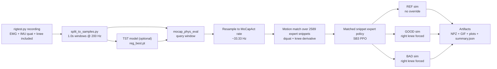
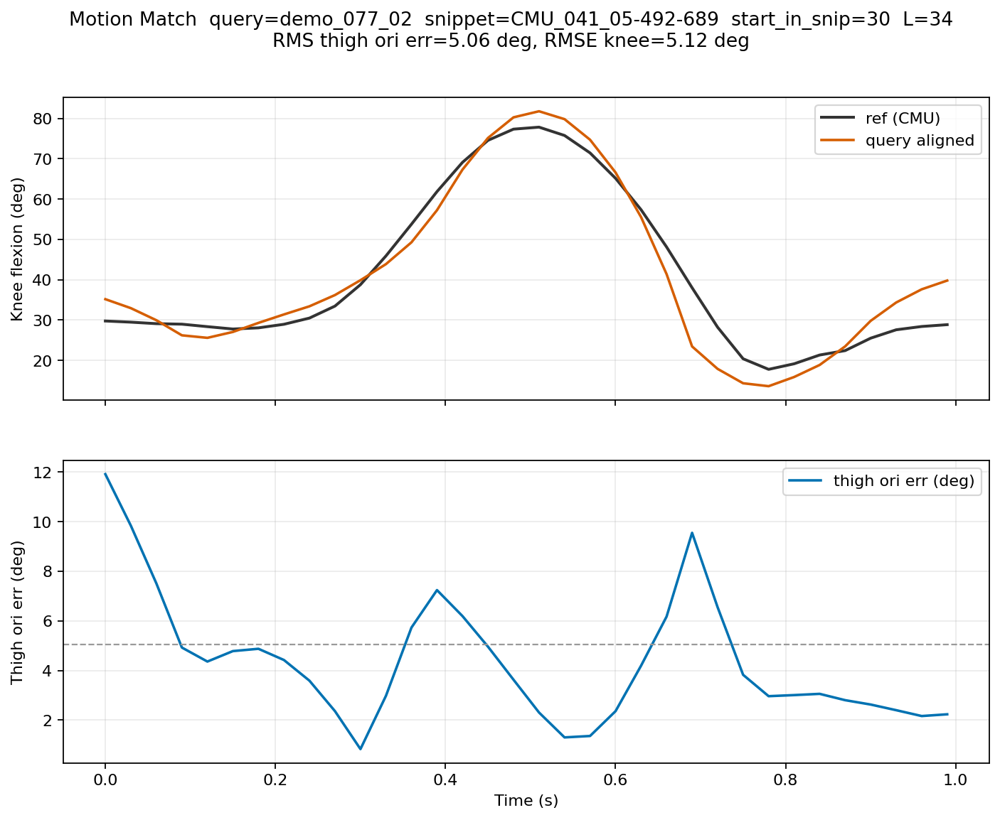
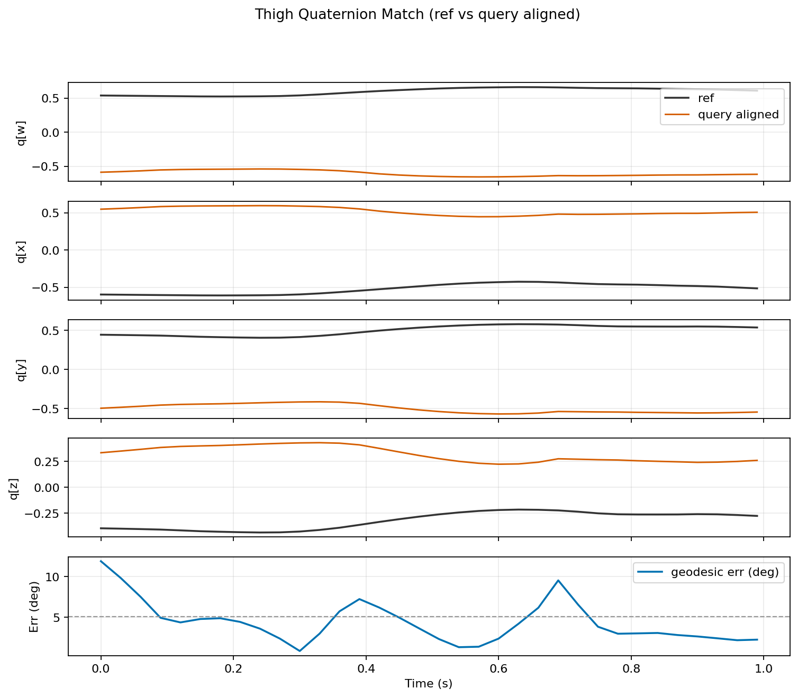
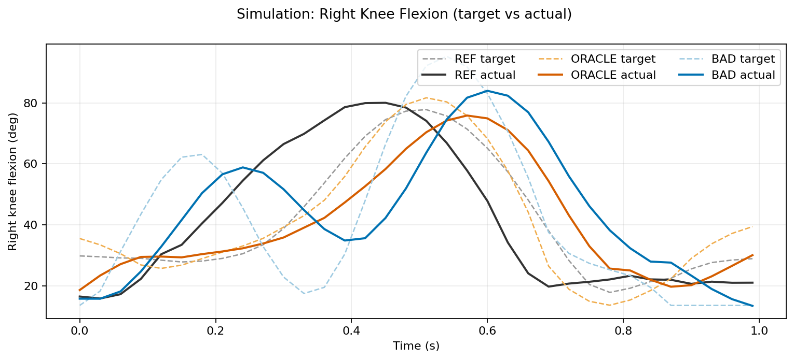
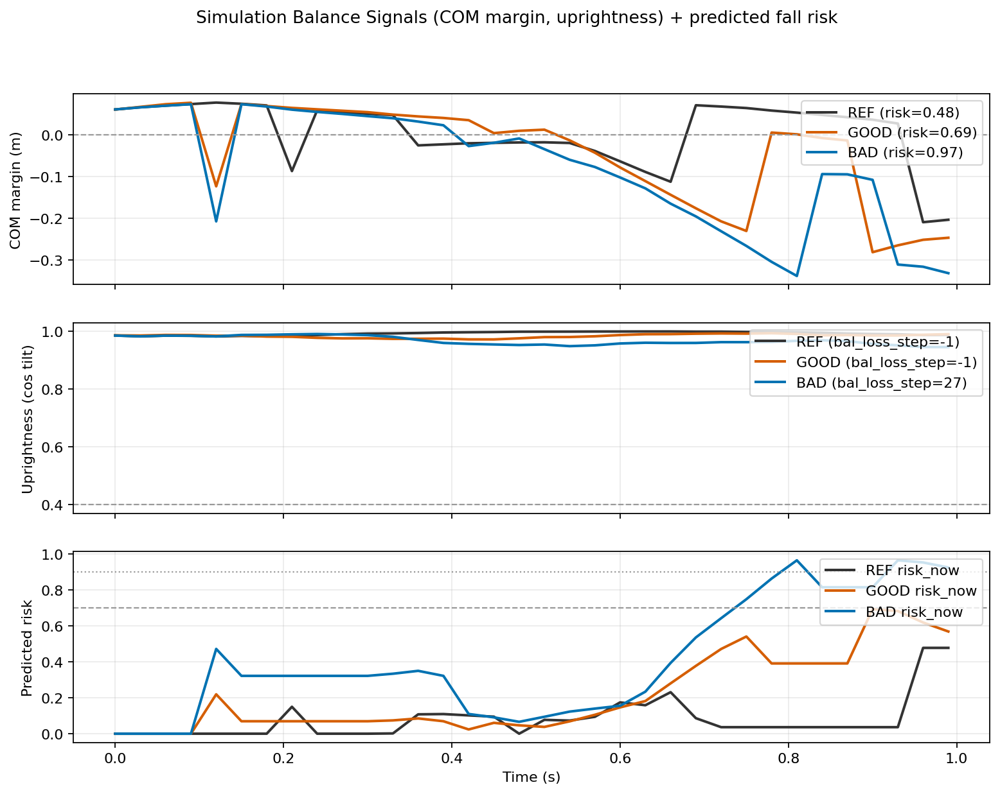

# emg_tst

Real-time EMG/IMU knee-angle prediction (TST) evaluated in **MoCapAct** physics via **per-snippet expert policies** (N=2589).

The evaluation pipeline:

- motion-matches each fixed-length TST window to the best MoCapAct snippet
- runs **real MuJoCo** simulation using the matched snippet’s **expert policy**
- forces the **right knee** (prosthetic knee) to follow either:
  - `GOOD`: the TST model’s predicted knee angle (or oracle until your model is trained)
  - `BAD`: a smooth ~20 deg RMSE perturbation (demo stand-in)
- reports motion-matching error separately from model error

**Example output (3-panel compare: REF | GOOD | BAD)**


## Repo Structure

- `emg_tst/`: Time Series Transformer (TST) that maps EMG + IMU features to a knee angle (your rig convention: included angle).
- `mocap_phys_eval/`: physical evaluation (motion matching + MuJoCo sim + viewer + plots).

## Install

```bash
pip install -r requirements_tst.txt
```

## Pipeline Overview



## Disk + Download Setup (Required)

The full MoCapAct expert zoo is large:

- 8 tarballs (Hugging Face)
- ~150+ GB extracted
- plan on >=200 GB free

Set the storage location (recommended: a large non-OneDrive drive):

```powershell
$env:MOCAPACT_MODELS_DIR = "D:\\mocapact_models"
```

Permanent (new terminals only):

```powershell
setx MOCAPACT_MODELS_DIR "D:\\mocapact_models"
```

Optional: move artifacts off the repo:

```powershell
$env:MOCAP_PHYS_EVAL_ARTIFACTS_DIR = "D:\\phys_eval_v2_artifacts"
```

### Hugging Face token (avoid anonymous throttling)

```powershell
$env:HF_TOKEN = "hf_..."
```

This is never printed; it is only used in request headers.

### Resume behavior

Downloads are resumable:

- the builtin downloader writes `*.tar.gz.part`
- rerunning `python -m mocap_phys_eval.prefetch` resumes from the partial file
- extraction completion is tracked with `<MODELS_DIR>/_downloads/experts_X.extracted`

### Faster downloads (optional)

You can select a backend:

```powershell
$env:MOCAPACT_DOWNLOAD_BACKEND = "urllib"      # resumable (default if aria2c not installed)
$env:MOCAPACT_DOWNLOAD_BACKEND = "hf_transfer" # fast; not a safe resume across interruptions
```

If you want to keep tarballs after extraction:

```powershell
$env:MOCAPACT_KEEP_TARBALLS = "1"
```

## One-Time Prefetch (Recommended)

Download/extract the expert zoo and build the reference bank:

```bash
python -m mocap_phys_eval.prefetch
```

## Run The Physical Evaluation

Run the evaluator (no CLI flags):

```bash
python -m mocap_phys_eval
```

Replay the latest run:

```bash
python -m mocap_phys_eval.replay
```

## Sample Plots (From Demo Run)

Motion match quality (aligned query vs matched expert snippet):



Quaternion alignment error (geodesic angle per step):



Simulation knee tracking (target vs actual):



Balance signals + heuristic risk trace:



## Using Real rigtest.py Data (The Real Pipeline)

1. Record `data*.npy` using `uMyo_python_tools/rigtest.py`.
   - Required: each recording must include `thigh_quat_wxyz` (wxyz quaternion).
2. Build windowed samples:

```bash
python split_to_samples.py
```

This writes `samples_dataset.npy` with non-overlapping 1.0s windows at 200 Hz (window=200). Recordings are resampled onto an exact 200 Hz grid using rigtest timestamps to remove timing jitter (so `WINDOW=200` really means 1.0s).

Note on “window size 32” in the TST pipeline: `emg_tst/data.py` uses `RAW_WINDOW=32` as a **rolling raw-EMG window** (in raw samples) to compute per-timestep EMG features. It does not change the TST sample length. The TST sample/window length is `WINDOW=200` timesteps (1.0s at 200 Hz).

3. Train a TST model (optional for now):

```bash
python -m emg_tst.run_experiment
```

This writes checkpoints under `checkpoints/**/reg_best.pt`.

The evaluator auto-selects the latest `*_all/` training run (the "ALL FEATURES" model) and picks the fold with the lowest `metrics.json.best_rmse`.

4. Run the evaluator again:
   - If a checkpoint exists, `GOOD` uses the model prediction.
   - If no checkpoint exists, `GOOD` is an oracle (ground truth knee) and is still useful to validate motion matching + simulation.

## Angle Conventions

- Your rig label is the **absolute included knee angle**: `0 = fully bent`, `180 = straight`.
- MoCapAct's knee joint is **flexion**: `0 = straight`.
- Conversion used everywhere in `mocap_phys_eval`: `knee_flex_deg = 180 - knee_included_deg`.

## What `python -m mocap_phys_eval` Does (Per Window)

Each run evaluates `EvalConfig.eval_n_windows` independent windows (no aggregation; window length matches TST train/eval). Default is `3` so each run produces a small batch of results; set it to `1` in `mocap_phys_eval/config.py` if you want a single window per run.

1. **Query window source**
   - Preferred: `samples_dataset.npy` produced by `split_to_samples.py`.
   - Demo-only fallback (pipeline sanity check): if `samples_dataset.npy` does not exist, the evaluator downloads a real **non-CMU** BVH from the web to exercise motion matching + simulation. Once you have rig recordings, BVHs are not downloaded and the query always comes from your recorded windows.

2. **Resample**
   - Query windows are recorded at 200 Hz but MoCapAct runs at ~33.33 Hz (control timestep ~0.03s), so we resample to the simulator rate.

3. **Motion match (full expert bank)**
   - Matches against all N=2589 expert snippets.
   - Uses thigh orientation quaternion + knee flexion derivatives (offset-invariant coarse stage), then refines for the top candidates:
     - constant thigh quaternion alignment (wxyz, geodesic error)
     - constant knee sign + offset (deg)
   - Reports motion-matching error:
     - `rmse_knee_deg`
     - `rms_thigh_ori_err_deg` (RMS quaternion geodesic error)

4. **MuJoCo simulation (expert policy)**
   - `REF`: matched expert policy runs normally (no overrides).
   - `GOOD`: same policy, but the **right knee actuator** is forced each step to a target knee angle.
   - `BAD`: same, but knee is perturbed with a smooth deterministic ~20 deg RMSE error (demo-only stand-in).

Override rule (important):

- The RL policy controls **all other actuators** normally.
- In `GOOD` and `BAD`, the RL policy **cannot directly control the right knee**, because the knee actuator command is overwritten each step.
- `summary.json` includes diagnostics (`ctrl_override_diag`) to confirm the applied knee control matches the forced target.

## Why Is Motion Matching Fast?

Even though we match over 2589 snippets, it’s fast because:

- each query is only **1.0s** and is resampled to ~33 Hz (so ~34 frames)
- coarse matching uses derivative features (`dquat` + `d knee`) and `np.convolve`-based sliding SSE in NumPy (C-accelerated)
- only `top_k` candidates are refined; only the final best match loads an expert policy for simulation

## Prosthetic Foot / Ankle (Not Implemented Yet)

The current evaluator keeps the CMU humanoid morphology intact and only overrides the **right knee**.

This is intentional: MoCapAct's expert zoo (N=2589) is trained for the original model. If you remove/lock/change the right ankle or foot geometry/joints, the expert policies are no longer "experts" for that modified body and `REF` will often fail. Doing this rigorously requires retraining experts (or distilling a new multi-clip policy) on the modified morphology.

If/when you want to emulate a passive ankle/foot (no ankle actuation) without changing geometry, the right-foot actuators in the model are:

- `walker/rfootrx`
- `walker/rfootrz`
- `walker/rtoesrx`

5. **Stability heuristic**
   - Outputs a per-step `predicted_fall_risk_trace_*` and scalar `predicted_fall_risk_*`.
   - Uses uprightness + COM support margin (no root-height heuristics).
   - `balance_loss_step_*` is the first timestep the heuristic considers the walker unstable.

## Visualization

Each window records a compare replay and opens an interactive viewer with 3 panels:

- `REF` (grey walker, no override)
- `GOOD` (orange walker, right leg highlighted in magenta)
- `BAD` (blue walker, right leg highlighted in magenta)

Controls:

- Mouse: RMB drag rotate, LMB drag pan, wheel zoom
- Keys: WASD or arrows translate, Q/E (or PgUp/PgDn) up/down, Shift = faster
- Keys: 1/2/3 select panel, r reset selected camera

## Outputs

Per run:

- `artifacts/phys_eval_v2/runs/<run_id>/summary.json`
- `artifacts/phys_eval_v2/runs/<run_id>/evals/<idx>_<query_id>/summary.json`
- plots under each `evals/.../plots/`
- replay under each `evals/.../replay/compare.npz` and `compare.gif`

Convenience pointers:

- `artifacts/phys_eval_v2/latest_compare.npz`
- `artifacts/phys_eval_v2/latest_compare.gif`
- `artifacts/phys_eval_v2/latest_motion_match.png`
- `artifacts/phys_eval_v2/latest_thigh_quat_match.png`
