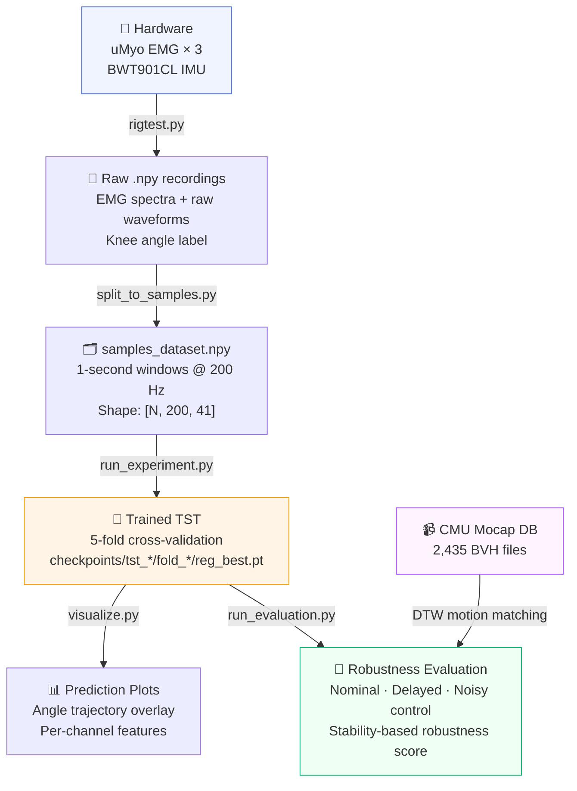
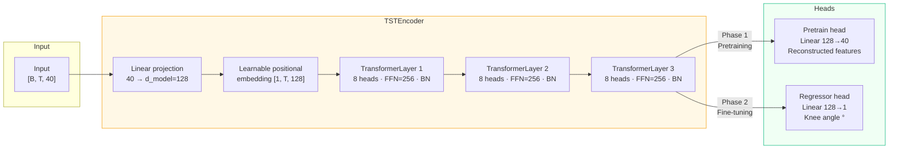
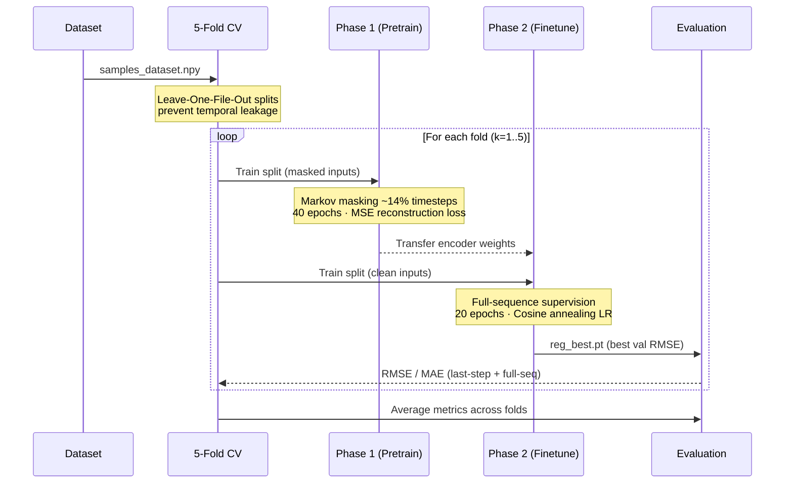
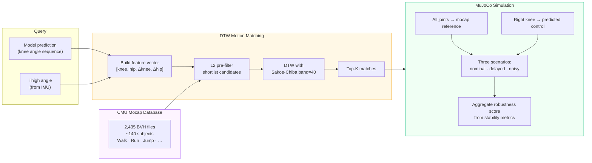

# emg_tst

> **Knee joint angle prediction from surface EMG signals using a Time Series Transformer**

[](https://www.python.org/)
[](https://pytorch.org/)
[](https://mujoco.org/)
[](LICENSE)

A research system that reads multi-channel surface EMG from wearable hardware, trains a transformer model to predict continuous knee joint angle, and validates predictions by driving a full-body physics simulation.

---

## Pipeline Overview



---

## Model Architecture

The model is a three-level stack where each class wraps the previous:



### Hyperparameters

| Parameter | Value | Notes |
|-----------|-------|-------|
| `d_model` | **128** | Embedding dimension |
| `n_heads` | **8** | Attention heads |
| `d_ff` | **256** | FFN hidden size |
| `n_layers` | **3** | Encoder depth |
| `dropout` | 0.1 | |
| `batch_size` | 64 | |
| `lr` | 3e-4 | RAdam, phase 1 |
| Pretrain epochs | **40** | Masked reconstruction |
| Finetune epochs | **20** | Cosine annealing LR |
| `seq_len` | 200 | 1 second @ 200 Hz |
| `n_vars` | **40** | Input features |

---

## Feature Engineering

Each **1-second window** at 200 Hz produces 40 input features:

```
┌─────────────────────────────────────────────────────────┐
│                    Input Features (40)                  │
├─────────────┬──────────────────────────────────────────┤
│  Sensor 1   │  RMS  MAV  WL  ZC  SSC  │  Band 1-8 FFT  │
│  Sensor 2   │  RMS  MAV  WL  ZC  SSC  │  Band 1-8 FFT  │  ×3 EMG sensors
│  Sensor 3   │  RMS  MAV  WL  ZC  SSC  │  Band 1-8 FFT  │
├─────────────┴──────────────────────────────────────────┤
│             Thigh Angle  (1 feature)                    │  BWT901CL IMU
└─────────────────────────────────────────────────────────┘
  Per sensor: 5 time-domain + 8 spectral = 13 features
  Total: 3 × 13 + 1 = 40
```

| Feature | Description |
|---------|-------------|
| **RMS** | Root mean square — signal power |
| **MAV** | Mean absolute value — contraction intensity |
| **WL** | Waveform length — signal complexity |
| **ZC** | Zero crossings (normalized) — frequency proxy |
| **SSC** | Slope sign changes (normalized) — waveform smoothness |
| **FFT bands 1-8** | Spectral power in 8 logarithmic frequency bins |

---

## Training Strategy



### Masking Strategy

Pretraining uses a **stateful 2-state Markov chain** (not i.i.d. Bernoulli):

```
 State: UNMASKED ──p_u──► MASKED
                ◄──p_m──

 p_m = 1 / lm          (lm = 3 timesteps mean segment length)
 p_u = p_m × r / (1-r) (r = 0.14 target mask ratio)

 Result: ~14% masked · contiguous runs of ~3 steps
         more realistic than random per-timestep dropout
```

---

## Angle Convention

> **CRITICAL**: All angles everywhere use the **included-angle** convention.

```
  Full extension:   180°  ────────────────
  Mid flexion:      ~120° ──────┐
  Deep flexion:      ~60° ───┐  │
                              └──┘

  included = 180° − flexion_angle
```

This convention is used consistently in hardware recording (`rigtest.py`), BVH parsing, motion matching, and MuJoCo simulation.

---

## Mocap Evaluation Pipeline



### Metrics

| Metric | Description | Threshold |
|--------|-------------|-----------|
| **CoM height** | Center of mass height during gait | Fall if `< 0.55 m` |
| **Gait symmetry** | Right/left step interval ratio | 1.0 = perfect |
| **Step count** | Contact events detected | Compared vs reference |
| **Stability score** | Per-scenario gait stability | Higher = better |
| **Robustness score** | Mean stability across nominal/delayed/noisy runs | Higher = better |
| **Knee RMSE/MAE** | Predicted vs. mocap reference | Degrees |

---

## Quickstart

### Install Dependencies

```bash
pip install -r requirements_tst.txt
```

### 1. Record Data *(requires hardware)*

```bash
# Record EMG + IMU — writes data0.npy, data1.npy, ...
python uMyo_python_tools/rigtest.py

# Inspect a recording
python plotdata.py
```

> **Hardware**: `rigtest.py` requires a **uMyo EMG device** (serial, 921600 baud) and a **BWT901CL IMU** (Bluetooth). Cannot run headlessly.

### 2. Prepare Dataset

```bash
# Slice recordings into non-overlapping 1-second windows
python split_to_samples.py
```

Output: `samples_dataset.npy` — array of shape `[N, 200, 41]`
*(200 timesteps × 40 features + 1 target angle per window)*

### 3. Train

```bash
python -m emg_tst.run_experiment
```

Saves checkpoints to `checkpoints/tst_YYYYMMDD_HHMMSS/fold_XX/reg_best.pt`.
All hyperparameters are **hardcoded at the top of `run_experiment.py`** — edit directly.

### 4. Visualize Predictions

```bash
python -m emg_tst.visualize
```

Auto-loads the latest checkpoint. Edit `CKPT_PATH` in `visualize.py` to target a specific run.

### 5. Run Mocap Evaluation (paper-style robustness protocol)

```bash
# Download CMU database (~2,435 BVH files)
python -m mocap_evaluation.cmu_downloader --dest mocap_data/cmu
python -m mocap_evaluation.cmu_downloader --verify --dest mocap_data/cmu

# Evaluate a trained checkpoint
python -m mocap_evaluation.run_evaluation \
  --checkpoint checkpoints/<run>/fold_01/reg_best.pt \
  --data samples_dataset.npy \
  --top-k 5 --eval-seconds 4 \
  --delay-ms 60 --noise-std-deg 6 \
  --out eval_results.json

# Test-sample mode (no checkpoint required)
python -m mocap_evaluation.run_evaluation \
  --test-sample --test-sample-source external \
  --top-k 5 --eval-seconds 4 \
  --delay-ms 60 --noise-std-deg 6 \
  --out eval_test_sample.json
```

### 6. Visualize a Motion Match

```bash
python -m mocap_evaluation.visualize_match \
  --aggregate-datasets \
  --mocap-dir mocap_data \
  --seconds 6 \
  --out artifacts/match_plot.png
```

---

## Repository Structure

```
emg_tst/
├── emg_tst/                         # Core TST model package
│   ├── model.py                    # Transformer definitions (encoder, pretrainer, regressor)
│   ├── data.py                     # Data loading, feature extraction, dataset classes
│   ├── masking.py                  # Stateful Markov masking for pretraining
│   ├── run_experiment.py           # Main training script (5-fold CV, hardcoded config)
│   └── visualize.py                # Prediction visualization
├── mocap_evaluation/                # Motion capture evaluation pipeline
│   ├── bvh_parser.py               # BVH motion capture file parser
│   ├── cmu_catalog.py              # CMU mocap database index (2,435 files)
│   ├── cmu_downloader.py           # Batch downloader with verification & retry
│   ├── mocap_loader.py             # Load BVH → 200 Hz standardized joint angles
│   ├── motion_matching.py          # DTW-based mocap-to-IMU signal matching
│   ├── prosthetic_sim.py           # MuJoCo physics simulation
│   ├── run_evaluation.py           # CLI entrypoint for the robustness evaluation protocol
│   ├── paper_pipeline.py           # Core paper-style evaluation logic and scoring
│   ├── visualize_match.py          # Plot matched mocap vs query curves
│   ├── sample_data.py              # Extract real walking segments from recordings
│   ├── external_sample_data.py     # External gait data (OpenSim) handling
│   └── mock_data.py                # Generate synthetic knee/thigh curves for testing
├── uMyo_python_tools/               # Hardware sensor SDK
│   ├── rigtest.py                  # Main data recording script (EMG + IMU)
│   ├── umyo_class.py               # uMyo device abstraction
│   ├── umyo_parser.py              # EMG parsing and feature extraction
│   ├── umyo_mouse.py               # Real-time EMG → mouse cursor control
│   ├── quat_math.py                # Quaternion math for IMU orientation
│   ├── display_stuff.py            # Real-time multi-channel plotting
│   └── ...
├── run_quick_sim.py                 # Standalone gait simulation demo
├── split_to_samples.py             # Convert recordings to fixed-length windows
├── plotdata.py                     # Visualize raw recordings
├── imutest.py                      # Real-time IMU streaming/visualization
└── requirements_tst.txt            # Python dependencies
```

---

## Data Flow Detail

```
Recording (.npy dict)
  emg_sensor{1,2,3}   — spectrum features  ~200 Hz
  raw_emg_sensor{1,2,3} — raw waveform     ~400 Hz
  imu                 — knee angle label   200 Hz  (included-angle °)
  thigh_angle         — secondary input    200 Hz
  effective_hz        — actual sample rate

        ↓  split_to_samples.py  (non-overlapping, WINDOW=200)

samples_dataset.npy  (NumPy dict)
  X          [N, 200, 40]    — feature windows (z-score normalized per fold)
  y          [N]             — scalar label (last timestep)
  y_seq      [N, 200]        — full angle trajectory
  file_id    [N]             — source recording index (for LOFO splits)

        ↓  5-fold CV training

checkpoints/tst_*/fold_*/reg_best.pt  (PyTorch .pt)
  reg_state_dict   — TSTRegressor weights
  model_cfg        — architecture params
  task_cfg         — prediction settings
  scaler           — {mean, std} from training fold

        ↓  run_evaluation.py

eval_results.json  — per-match nominal/delayed/noisy metrics + robustness scores
```

---

## Hardware Setup

| Component | Spec | Interface |
|-----------|------|-----------|
| **uMyo EMG** | 3 surface electrodes | Serial 921600 baud |
| **BWT901CL IMU** | 6-axis + magnetometer | Bluetooth RFCOMM port 1 |
| **PC** | Python 3.8+, Linux/Windows | — |

**IMU configuration commands sent on connect:**
- `UNLOCK`: `FF AA 69 88 B5`
- `200 Hz sampling`: `FF AA 03 0B 00`
- `Save config`: `FF AA 00 00 00`

---

## Dependencies

| Package | Role |
|---------|------|
| `torch` | Transformer model and training |
| `numpy` | Data I/O and numerical computing |
| `scipy` | Signal resampling and spatial transforms |
| `mujoco` | Physics simulation backend |
| `matplotlib` | All plotting |
| `pillow` | GIF generation for gait visualization |
| `tqdm` | Download/training progress bars |
| `pywitmotion` | BWT901CL IMU Bluetooth communication |
| `pyserial` | uMyo EMG device serial communication |

---

## Key Design Decisions

**Why Markov masking instead of i.i.d.?**
Contiguous masked segments force the model to interpolate across time, learning temporal dynamics rather than independently reconstructing each timestep from its neighbors.

**Why full-sequence supervision?**
The regressor predicts the angle at every timestep (not just the last). This provides denser gradient signal, improves internal representations, and makes the model useful for real-time streaming applications.

**Why included-angle convention?**
The BWT901CL IMU natively outputs orientation data that maps cleanly to included-angle. Using flexion angle would require sign-flipping in multiple places and is more error-prone.

**Why Leave-One-File-Out CV?**
Consecutive 1-second windows from the same recording are highly correlated. Simple random splits would leak information; LOFO ensures the validation set comes from entirely different recording sessions.
