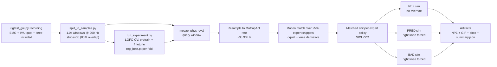

# emg_tst

Real-time EMG/IMU knee-angle prediction using a **Time Series Transformer (TST)**, evaluated in **MoCapAct** physics via **per-snippet expert policies** (N=2589).

The goal is to predict the intended knee flexion angle of a prosthetic leg from surface EMG electrodes and an inertial measurement unit (IMU) on the residual thigh — inputs that are available on the prosthetic side without any sensor on the prosthetic shank or foot.

---

## Model & Training Pipeline (Methodology)

### Problem Statement

Given a 1-second sliding window of surface EMG features and thigh orientation (IMU quaternion) from the residual limb, predict the continuous knee included angle (degrees, 0 = fully bent, 180 = fully extended) at every timestep in the window. The calf IMU is deliberately excluded from all model inputs — in a real prosthetic deployment, the calf is the prosthetic itself and no ground-truth shank orientation is available.

### Sensors and Features

Three surface EMG sensors are placed on:
- **Sensor 1**: vastus medialis (anterior thigh)
- **Sensor 2**: semimembranosus (posterior thigh)
- **Sensor 3**: biceps femoris (posterior thigh)

Each sensor streams raw EMG at approximately 400 Hz via Bluetooth (uMyo devices). From each sensor, 13 features are extracted per IMU timestep using a causal rolling window of 32 raw samples (~80 ms at 400 Hz):

| Feature | Description |
|---|---|
| RMS | Root mean square (log1p transformed) |
| MAV | Mean absolute value (log1p transformed) |
| WL | Waveform length — sum of absolute first differences (log1p transformed) |
| ZC | Zero crossing rate (normalized by window length) |
| SSC | Slope sign change rate (normalized by window length) |
| FFT0–FFT7 | Mean spectral power in 8 equal frequency bands (log1p transformed) |

Log1p transformation is applied to amplitude-based features (RMS, MAV, WL, spectral power) because raw EMG amplitude is right-skewed and roughly log-normal; log1p maps the heavy tail into a Gaussian-like range that standard normalization handles well.

Timestamp-based alignment is used when available (recordings from `rigtest_gui.py`): each IMU timestep is aligned to the last raw EMG sample that occurred at or before that IMU timestamp (causal). This eliminates burst-timing misalignment of up to ~20 ms that arises from the burst-of-8 Bluetooth packet structure.

In addition to EMG features, the thigh orientation quaternion (wxyz, 4 components) from sensor 2 is included, giving **43 input features total** (13 × 3 sensors + 4).

### Knee Angle Label

The knee included angle label is computed from the relative orientation of the thigh and calf IMUs:

```
knee_included_deg = 180 - atan2(sin(θ_thigh - θ_calf), cos(θ_thigh - θ_calf)) + offset
```

where θ_thigh and θ_calf are Euler-derived pitch angles from the respective quaternions, and `offset` is a per-recording calibration constant. The convention is: 0° = fully bent, 180° = fully extended. This label is computed at recording time and stored alongside the raw sensor data.

All recordings are resampled to a uniform **200 Hz** grid using their Bluetooth timestamps before feature extraction, so that the window length in seconds is consistent across recordings regardless of Bluetooth jitter.

### Windowing

Recordings are segmented into overlapping windows:
- **Window length**: 200 samples (1.0 s at 200 Hz)
- **Stride**: 30 samples (0.15 s, giving 85% overlap between consecutive windows)
- **Label**: the full angle trajectory for all 200 timesteps in the window (not just the last sample)

The 85% overlap increases the effective number of training samples significantly without introducing cross-file leakage — all windows from the same recording receive the same `file_id` so Leave-One-File-Out splits remain valid.

### Preprocessing

**Per-recording EMG normalization** is applied before training. EMG amplitude varies substantially between recording sessions due to electrode repositioning, skin impedance changes, sweat, and muscle fatigue. These are recording-level artifacts that carry no information about knee angle. To remove them, each recording's EMG features are independently z-scored (zero mean, unit variance per feature) using statistics computed from that recording's own windows.

For training and validation files: statistics are computed from the training file's windows only (no leakage from test). For the held-out test file: statistics are computed from the test file's own windows, simulating a brief per-session calibration pass that is standard practice in prosthetics deployment.

After per-recording normalization, a global `StandardScaler` (mean/std across all training windows) is fit and applied on top. The global scaler handles residual cross-session variance in the EMG features and normalizes the quaternion features, which are not per-recording normalized (they are unit-norm by construction).

Knee angle labels are normalized to [0, 1] by dividing by 180° before being passed to the loss function. This keeps MSE gradients in a well-conditioned range for the output head.

### Model Architecture

The model is an **encoder-only Time Series Transformer (TST)** following the PatchTST family, adapted for per-timestep regression.

**Encoder** (`TSTEncoder`):
- Input projection: linear layer mapping 43 input features → `d_model = 128`
- Learnable positional embedding: shape `(1, 200, 128)`, initialized with σ = 0.02
- **2 transformer encoder layers** (reduced from 3 to improve cross-session generalization given the small dataset of 6 recordings)
- Dropout: `p = 0.25` applied after input projection and within each layer

Each encoder layer (`TSTEncoderLayer`) uses **pre-norm residual connections** with **LayerNorm**:
```
x = x + Dropout(MHA(LayerNorm(x)))
x = x + Dropout(FFN(LayerNorm(x)))
```

where MHA is multi-head self-attention (`n_heads = 8`, `batch_first = True`) and FFN is a two-layer MLP with hidden dimension `d_ff = 256` and GELU activation.

Pre-norm (rather than post-norm) was chosen for training stability. LayerNorm (rather than BatchNorm) was chosen because BatchNorm statistics are corrupted by zero-filled masked positions during the masked pretraining stage, and because LayerNorm normalizes per-sample which is more appropriate for variable-length or masked sequences.

**Pretraining head** (`TSTPretrainDenoiser`): linear layer `d_model → 43`, used only during pretraining.

**Regression head** (`TSTRegressor`): linear layer `d_model → 1`, applied independently at every timestep to produce a per-timestep knee angle prediction. Output is in [0, 1] (normalized); multiply by 180° to recover degrees.

Total trainable parameters: approximately 280 K (encoder) + 129 (regression head).

### Training Procedure

Training consists of two sequential stages per fold: **masked reconstruction pretraining** followed by **supervised finetuning**.

#### Stage 1: Masked Reconstruction Pretraining (80 epochs)

The encoder is pretrained to reconstruct masked input features from unmasked context, following the BERT-style masked autoencoding approach. This encourages the encoder to learn cross-timestep temporal dependencies before seeing any angle labels.

**Masking**: Markov-chain stateful variable masking with mask rate `r = 0.15` and mean mask-run length `lm = 3` (geometric distribution). Masking is applied independently per batch element. Masked positions are set to zero in the input; the loss is computed only over masked positions:

```
L_pretrain = MSE(pred[masked], x[masked])
```

Mask generation is performed on CPU and moved to the GPU after construction. This is required to avoid a bug in DirectML (AMD GPU backend) where boolean advanced indexing (`state[bool_mask] = val`) produces incorrect results on the GPU.

Clean (non-augmented) inputs are used for pretraining. The masking itself is the regularizer; adding amplitude noise on top would make the reconstruction task unnecessarily hard and slow convergence without improving the learned representation.

**Optimizer**: RAdam, `lr = 3×10⁻⁴`, `weight_decay = 1×10⁻⁴`.
**LR schedule**: cosine annealing from `lr` to `lr × 0.01` over 80 epochs.
**Best checkpoint**: the pretrain checkpoint with lowest reconstruction MSE is restored before finetuning begins.

#### Stage 2: Supervised Finetuning (100 epochs)

The pretrained encoder is attached to a randomly initialized linear regression head and trained end-to-end on the angle prediction task.

**Loss**: mean squared error over all timesteps in the window:
```
L_finetune = MSE(pred_seq * 180, y_seq * 180)  [in normalized [0,1] space]
```

**Head bias initialization**: the regression head bias is initialized to the training-set label mean (normalized), i.e., `bias = mean(y_train) / 180`. Default PyTorch initialization gives bias ≈ 0, which predicts ~0° against labels of ~100–170°, producing RMSE ≈ 140° at epoch 1 and extremely slow convergence. Initializing to the label mean immediately gives RMSE ≈ std(y_train) ≈ 30–40° at epoch 1.

**Separate learning rates**: the pretrained encoder uses `lr = 3×10⁻⁴`; the randomly initialized head uses `lr = 3×10⁻³` (10×). Without this, the head receives almost no update budget under gradient clipping.

**Optimizer**: RAdam with parameter groups as above, `weight_decay = 1×10⁻⁴`.
**LR schedule**: cosine annealing from `lr` to `lr × 0.01` over 100 epochs.
**Gradient clipping**: global norm clipped to 1.0.
**Best checkpoint**: selected by lowest validation RMSE (last-timestep) over all finetune epochs.

**Data augmentation** (training only, not validation or test):
- Gaussian noise: `x ← x + ε`, `ε ~ N(0, 0.03²)` in normalized units
- Amplitude jitter: `x ← x × s`, `s ~ Uniform(0.85, 1.15)`

These augmentations are applied in `SamplesArrayDataset.__getitem__` only for the training split, and are not applied during pretraining.

### Cross-Validation

**Leave-One-File-Out (LOFO)** cross-validation: with N recording files, each file is held out once as the test set and the model is trained on the remaining N−1 files. This is a strict cross-session evaluation — the held-out file comes from a separate recording session with independent electrode placement.

Within each outer fold, an additional inner validation split is used for checkpoint selection (to avoid selecting the best epoch directly on the test set). The inner validation set is preferably an entire held-out recording file; if only one training file exists, a random 10% window split is used as a fallback.

The reported metric is **test seq RMSE** (degrees): RMSE over all timesteps of all windows in the held-out test file, using the checkpoint selected by inner-validation RMSE. This is the cross-session generalization error.

### Ablation Study

The pipeline runs three feature configurations automatically:
1. **All features**: EMG (39) + thigh quaternion (4) = 43 features
2. **Thigh only**: quaternion (4 features) — baseline without EMG
3. **EMG only**: EMG features (39) — no IMU

This ablation quantifies the marginal contribution of EMG beyond what thigh orientation alone provides (and vice versa).

### Hardware

Training uses an **AMD Radeon RX 6550M** GPU via **torch-directml** (DirectML backend). CUDA is not available on this machine. DirectML has a known limitation with boolean advanced indexing on GPU tensors; any operations of the form `tensor[bool_mask] = value` are performed on CPU and moved to device afterward.

---

## Repo Structure

- `emg_tst/` — Time Series Transformer: data loading, feature extraction, model, training loop
  - `data.py` — raw EMG feature extraction, resampling, `load_recording`
  - `model.py` — `TSTEncoderLayer`, `TSTEncoder`, `TSTPretrainDenoiser`, `TSTRegressor`
  - `masking.py` — Markov-chain stateful variable masking
  - `run_experiment.py` — training pipeline: LOFO CV, pretraining, finetuning, ablation study
- `split_to_samples.py` — builds `samples_dataset.npy` from raw recordings
- `plot_data.py` — visualization: overview, episode, distribution, correlation, summary figures
- `uMyo_python_tools/` — sensor firmware tools and recording GUI (`rigtest_gui.py`)
- `mocap_phys_eval/` — physical evaluation in MuJoCo using MoCapAct expert policies

---

## Install

```bash
pip install -r requirements_tst.txt
```

For AMD GPU support (Windows):
```bash
pip install torch-directml
```

---

## Pipeline Overview



---

## Data Recording

Record `data*.npy` files using `uMyo_python_tools/rigtest_gui.py`.

Requirements per recording:
- `thigh_quat_wxyz` (wxyz quaternion from thigh IMU, 4 dims) — required
- `raw_emg_sensor{1,2,3}` + `raw_emg_times{1,2,3}` — raw EMG with per-sample timestamps
- `timestamps` — IMU timestamps (seconds) for resampling
- `knee_included_deg` — knee angle label

See `docs/data_recording_plan.md` for the full recording protocol, QC checklist, and how to estimate the number of sessions needed for a target RMSE.

### Build the Sample Dataset

```bash
python split_to_samples.py
```

Writes `samples_dataset.npy` with overlapping 1.0 s windows at 200 Hz (window=200, stride=30). Recordings are resampled onto an exact 200 Hz grid using their Bluetooth timestamps.

**Note on the 32-sample EMG window**: `emg_tst/data.py` uses `RAW_WINDOW=32` as a causal rolling raw-EMG window (in raw samples, not IMU samples) to compute per-timestep EMG features. This is an internal feature-extraction detail and does not affect the TST window length, which is always 200 IMU timesteps (1.0 s).

---

## Train the Model

```bash
python -m emg_tst.run_experiment
```

Runs the full ablation study (all features / thigh only / EMG only) with LOFO cross-validation. Writes checkpoints under `checkpoints/**/reg_best.pt` and a `cv_manifest.json` per run.

### Key hyperparameters (current values)

| Parameter | Value | Notes |
|---|---|---|
| `WINDOW` | 200 | 1.0 s at 200 Hz |
| `STRIDE` | 30 | 85% window overlap |
| `D_MODEL` | 128 | Transformer embedding dimension |
| `N_HEADS` | 8 | Attention heads |
| `D_FF` | 256 | FFN hidden dimension |
| `N_LAYERS` | 2 | Encoder depth (reduced from 3 for small dataset) |
| `DROPOUT` | 0.25 | Applied throughout (increased for regularization) |
| `LR` | 3×10⁻⁴ | Encoder learning rate |
| `WEIGHT_DECAY` | 1×10⁻⁴ | Applied to both pretrain and finetune optimizers |
| `EPOCHS_PRETRAIN` | 80 | Masked reconstruction pretraining |
| `EPOCHS_FINETUNE` | 100 | Supervised regression finetuning |
| `MASK_R` | 0.15 | Markov masking rate |
| `MASK_LM` | 3 | Markov masking mean run length |
| `BATCH_SIZE` | 64 | |

---

## Learning Curve (Optional)

```bash
python -m emg_tst.learning_curve
```

Estimates how RMSE improves as more recorded data is added. Useful for deciding how many additional sessions to record before the next experiment.

---

## Physical Evaluation

Run the MoCapAct-based physical evaluator:

```bash
python -m mocap_phys_eval
```

Replay the latest run:

```bash
python -m mocap_phys_eval.replay
```

### Disk + Download Setup (Required for Physical Evaluation)

The full MoCapAct expert zoo is large (~150+ GB extracted). Set the storage location:

```powershell
$env:MOCAPACT_MODELS_DIR = "D:\\mocapact_models"
```

Permanent (new terminals only):

```powershell
setx MOCAPACT_MODELS_DIR "D:\\mocapact_models"
```

Optional: move artifacts off the repo:

```powershell
$env:MOCAP_PHYS_EVAL_ARTIFACTS_DIR = "D:\\phys_eval_v2_artifacts"
```

#### Hugging Face token (avoid anonymous throttling)

```powershell
$env:HF_TOKEN = "hf_..."
```

#### Downloads are resumable

- the builtin downloader writes `*.tar.gz.part`
- rerunning `python -m mocap_phys_eval.prefetch` resumes from the partial file
- extraction completion is tracked with `<MODELS_DIR>/_downloads/experts_X.extracted`

#### Faster downloads (optional)

```powershell
$env:MOCAPACT_DOWNLOAD_BACKEND = "urllib"      # resumable (default if aria2c not installed)
$env:MOCAPACT_DOWNLOAD_BACKEND = "hf_transfer" # fast; not safe to resume across interruptions
```

One-time prefetch:

```bash
python -m mocap_phys_eval.prefetch
```

---

## What `python -m mocap_phys_eval` Does

With real rigtest data and trained LOFO folds, the evaluator follows the paper protocol:

1. **Query window source**
   - Loads the full held-out pool from `samples_dataset.npy`.
   - Uses the latest `*_all/` training run and matches each held-out window to the correct outer-fold checkpoint.
   - Samples windows uniformly without replacement using fixed seed `42`.
   - If a sampled window fails motion matching or simulation, it is discarded and replaced by the next window in the same seeded order until `80` successful trials are retained.
   - Demo-only fallback: if `samples_dataset.npy` does not exist, the evaluator downloads a real non-CMU BVH and runs a small sanity-check batch.

2. **Resample**
   - Query windows are recorded at 200 Hz but MoCapAct runs at ~33.33 Hz (control timestep ~0.03 s), so we resample to the simulator rate.

3. **Motion match (full expert bank)**
   - Matches against all N=2589 expert snippets.
   - Uses thigh orientation quaternion + knee flexion derivatives (offset-invariant coarse stage), then refines for the top candidates:
     - constant thigh quaternion alignment (wxyz, geodesic error)
     - constant knee sign + offset (deg)
   - Reports motion-matching error: `rmse_knee_deg`, `rms_thigh_ori_err_deg`

4. **MuJoCo simulation (expert policy)**
   - `REF`: matched expert policy runs normally (no overrides).
   - `PRED`: same policy, but the right knee actuator is forced each step to the TST prediction.
   - `BAD`: auxiliary diagnostic trace (not part of paper analysis).

   Override rule: the RL policy controls all other actuators normally. In `PRED` and `BAD`, the right knee actuator command is overwritten each step, and the knee actuator's internal activation state (MuJoCo filter) is also overwritten so the forced command applies on the current step without a 1-step lag.

5. **Stability heuristic**
   - Per-step `predicted_fall_risk_trace_*`, scalar `predicted_fall_risk_*`, and `balance_risk_auc`.
   - Uses uprightness + XCoM support margin + tilt-rate + smoothing.

---

## Statistical Analysis

```bash
python -m analysis.correlation --run-dir artifacts/phys_eval_v2/runs/<run_id>
```

Computes the paper's partial Spearman correlation:
- predictor: `model.pred_vs_gt_knee_flex_rmse_deg`
- outcome: `sim.pred.balance_risk_auc`
- controls: `match.rmse_knee_deg`, `match.rms_thigh_ori_err_deg`

---

## Angle Conventions

- Rig label: **included knee angle** — 0 = fully bent, 180 = fully extended
- MoCapAct knee joint: **flexion** — 0 = straight
- Conversion used everywhere in `mocap_phys_eval`: `knee_flex_deg = 180 - knee_included_deg`

---

## Visualization

```bash
python plot_data.py
```

Generates five figure types:
- **Overview**: full recording time series (angle + EMG envelopes)
- **Episode**: best movement episode per recording file (angle, angular velocity, per-sensor EMG)
- **Distribution**: knee angle histogram per recording
- **Correlation**: per-feature Pearson r with knee angle (EMG features are expected to have low linear r — the transformer learns nonlinear temporal patterns)
- **Summary**: cross-session RMSE per fold from the latest training run

Each window also records a 3-panel compare replay (REF | PRED | BAD) and opens an interactive MuJoCo viewer.

Viewer controls: RMB drag rotate, LMB drag pan, wheel zoom, WASD/arrows translate, Q/E up/down, Shift = faster, 1/2/3 select panel, R reset selected camera.

---

## Outputs

Per training run:
- `checkpoints/<run_name>_all/fold_XX/reg_best.pt`
- `checkpoints/<run_name>_all/cv_manifest.json`
- `checkpoints/<run_name>_all/fold_XX/split_manifest.json`

Per physical evaluation run:
- `artifacts/phys_eval_v2/runs/<run_id>/summary.json`
- `artifacts/phys_eval_v2/runs/<run_id>/evals/<idx>_<query_id>/summary.json`
- plots under each `evals/.../plots/`
- replay under each `evals/.../replay/compare.npz` and `compare.gif`

Per analysis run:
- `artifacts/phys_eval_v2/runs/<run_id>/analysis/partial_spearman_summary.json`
- `artifacts/phys_eval_v2/runs/<run_id>/analysis/partial_spearman_trials.csv`
- `artifacts/phys_eval_v2/runs/<run_id>/analysis/partial_spearman_scatter.png`

Convenience pointers:
- `artifacts/phys_eval_v2/latest_compare.npz`
- `artifacts/phys_eval_v2/latest_compare.gif`
- `artifacts/phys_eval_v2/latest_motion_match.png`
- `artifacts/phys_eval_v2/latest_thigh_quat_match.png`

---

## Prosthetic Foot / Ankle (Not Implemented Yet)

The current evaluator keeps the CMU humanoid morphology intact and only overrides the right knee. If/when you want to emulate a passive ankle/foot, the right-foot actuators in the model are: `walker/rfootrx`, `walker/rfootrz`, `walker/rtoesrx`. Doing this rigorously requires retraining MoCapAct experts on the modified morphology.
